# Dinaup High Perfomance

El paquete `dinaup.highperfomance` permite utilizar herramientas avanzada para grandes cargas de trabajo.


## 📊 Caché de informes 📊
El caché de informes permite  guarda en memoria datos de Dinaup, actuando como un Service para acceder a la información al instante, sin consumir recursos de Dinaup Servidor. Es un gran aliado para entre otras cosas, duplicar información, sincronizada y balacenar la carde de trabajo.
   - 📌 Colecciones Tipadas
   - 🔄 Actualización automática de caché
   - 🖥 El caché se guarda en disco para asegurarse de que, si se reinicia la aplicación, no tengas que volver a cargar todos los datos.
   - 🔍 Caché filtrado: ¡Solo guarda lo que realmente necesitas!


## 📝 Cola de Cambios 📝
Si alguna vez has trabajado con grandes cargas de datos, sabrás que hacer operaciones de escritura directas y en tiempo real puede resultar en cuellos de botella, retrasos y problemas de rendimiento. Es aquí donde entra la Cola de Operaciones de Escritura del paquete 


----
 

# 📊 Caché de informes 📊
Si el inform es compatible con caché puedes crear `dinaup.client.cache.ReadCacheManager` para administrar multiples informes en memoria.


#  📝 Cola de Operaciones de Escritura  📝
Si alguna vez has trabajado con grandes cargas de datos, sabrás que hacer operaciones de escritura directas y en tiempo real puede resultar en cuellos de botella, retrasos y problemas de rendimiento. Es aquí donde entra la Cola de Operaciones de Escritura del paquete `dinaup.client.highperfomance`.
 

### Introdución 
- **DinaupClient** Es el cliente de Dinaup, puede encontrar más información en la documentación [dinaup.client](dinaup.client.md)
- **WirteOperation** Operación única de escritura (Agregar/Editar)
- **WriterQueue** Proporciona una cola de MISMAS acciones de escritura: Misma sección y mismos campos (Puede combinarse agregar y editar).
- **WriteQueueManager** Es la clase que se utiliza para gestionar un conjunto de colas.
- **FormBase** hereda de `WirteOperation` e incirpora lógica para hacerlo mas amigable.
  
 
### WriteQueueManager -> WriterQueue[] ->  WirteOperation[]


El API de Dinaup únicamente soporta `WriteOperation`, se le puede envíar de manera individual o en bloques. Enviarlas de manera individual corre el riesgo de consumir muchos recursos, mientras que enviarlas por lotes tienen la dificultad de crear una cola de `WriteOperation` e ir ejecutándolo poco a poco y es ahí donde nace  la clase `WriterQueue` que permitía crear una cola que además de ir ejecutando las operaciones por lotes y secuncialmente, tiene múltiples ventajas para monitorizar con grafana e  implementar rate limits.

Dado el éxito de `WriteQueue` se implementó `WriteQueueManager` que tiene como objetivo administrar múltiples colas, para porporciona una experiencia todabía más estable y sencillas.
 
Entonces  WriteQueueManager tiene múltiples WriterQueue que a su vez tiene múltiples   WirteOperation
> WriteQueueManager -> WriterQueue[] ->  WirteOperation[]
  


### Inicialización 
En este fragmento, estamos inicializando una instancia de `WriteQueueManager` y una instancia de `WriterQueue`.

 ``` vb.net

Public WithEvents WriteQueueManage As dinaup.client.highperformance.WriteQueueManager
Public WithEvents seccionPruebasqueue As New dinaup.client.highperformance.WriterQueue(SeccionDePruebasJSONES._SectionID)

```

### Agregando la WriterQueue al WriteQueueManager 
En este ejemplo solo hemos implementado un  WriterQueue pero puede implementar más.
 ``` vb.net
WriteQueueManage = New WriteQueueManager(DinaupClient)
WriteQueueManage.AddWriterQueue(seccionPruebasqueue)
WriteQueueManage.AddWriterQueue(...)
WriteQueueManage.AddWriterQueue(...)
WriteQueueManage.AddWriterQueue(...)
WriteQueueManage.AddWriterQueue(...)
WriteQueueManage.Ini()
```


### Ejecutando WriteOperation 
Ejemplo de agregar 100 insercciones.

``` vb.net

For ValorNumericoActual = 1 To 100
    Dim Datos As New Dictionary(Of String, String)
    Datos.Add(SeccionDePruebasJSONES.TextoPrincipal, Guid.NewGuid.STR)
    Datos.Add(SeccionDePruebasJSONES.ValorEntero, ValorNumericoActual)
    Dim registroId = "" 'Vacío para agregar
    Dim OperacionEscritura = New dinaup.client.WriteOperation(registroId, Datos)
    seccionPruebasqueue.Enqueue(OperacionEscritura)
Next

```


### Ejecutando FormBase 
Utilizar `Formbase` no es una buena ni una mala decisión, generalmente suele aportar gran valor cuando el usuario introduce datos mediante un formulario ya que tiene opciones de estado, validación... 
 - Asignar los valores a variables tipadas
 - Crear función de Validar
 - Adminsitrar el estado
 - Compatibildiad con Formularios [dinazor](dinazor.md).


``` vb.net

For ValorNumericoActual = 1 To 100
    Dim Datos As New DatosDePruebaForm
    Datos.ValorNumerico = ValorNumericoActual
    seccionPruebasqueue.Enqueue(ValorEntero)
Next

```


``` vb.net

    Public Class DatosDePruebaForm
        Inherits FormBase


        Public ID As Guid
        Public ValorNumerico As Integer


        Public Overrides ReadOnly Property thetodicfunctionwillalwaysreturnthesamecolumns As Boolean
            Get
                ' Siempre debe devolver TRUE
                Return True
            End Get
        End Property

        Protected Overrides Async Function _iniAsync() As Task(Of Tuple(Of Boolean, String))

            Await Task.CompletedTask
            ' AQUI PUEDE CARGAR LOS VALORES iniciales
            ' tanto para editar registro, como los valores predetermiandos de agregar 


            if ID <> guid.empty then

            end if 

            Return Tuple.Create(False, "Ejemplo de error.")

        End Function

        Protected Overrides Function _Save(Session As IUserSession, Notificador As IWriteOperationNotifier) As Task(Of WriteOperation)
            Throw New NotImplementedException()
        End Function

        Public Overrides Function _InvalidDataReason() As String
            If ValorNumerico < 1 Then Return "No se permiten valores negativos."
            Return ""
        End Function

        Public Overrides Function _ToDic() As Dictionary(Of String, String)

            '! Observaciones 
            ', - El campo Clave principal de  todas las Secciones es ID 
            ', - Si ID  es  String.Empty creará uno nuevo sino lo modicará 
            ', - ID es de tipo System.Guid que si está vació es Guid.Empty. Guid.Empty.ToString devuelve 0000-000.... por eso se usa .STR 
            ',       .STR deuvelve  String.Empty ssi es Guid.Empty
            ', - Siempre debe devolver las mismas columnas no poner Ifs que proporicionen columnas diferentes. 
            ', - Si se va a utilizar ordenes diferentes, deberás crear otro form_ y otro Queue 


            Dim r As New Dictionary(Of String, String)
            r.Add("id", ID.STR)
            r.Add(dinaup.commonstructure.SectionsD.SeccionDePruebasJSOND.SeccionDePruebasJSONES.ValorEntero, ValorNumerico.STR)
            Return r
        End Function

        Sub New()
            MyBase.New(True)
        End Sub

    End Class


`````
  
